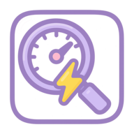

# 電力監控 Android | PowerTesting Monitor Android

**專業的Android電池消耗監控工具**  
**Professional Battery Consumption Monitoring Tool for Android**

[繁體中文](#繁體中文) | [English](#english)

---

## 繁體中文

### 📱 關於電力監控

電力監控是一款專業的Android應用程式，專為精確的電池消耗監測和分析而設計。它提供即時電池使用追蹤、浮動視窗介面、全面的測試管理和詳細的消耗報告。

### ✨ 主要功能

#### 🔋 **專業電池監控**
- **即時追蹤**: 精確的電池電量監測和消耗計算
- **浮動視窗**: 140x140dp浮動視窗，持續監控不中斷
- **智能分析**: 詳細的消耗率分析和報告

#### 🎯 **智能測試管理**
- **彈性時長**: 可自訂1到120分鐘的測試時間
- **快速選擇**: 一鍵30分鐘和60分鐘預設按鈕
- **自動設定**: 自動測試配置和電池優化指導

#### 🎵 **多感官反饋**
- **音效提示**: 測試開始和完成的確認音效
- **震動反饋**: 觸覺反饋提升用戶體驗
- **智能適配**: 自動適配不同Android版本

#### 🌍 **多語言支援**
- **繁體中文**: 完整介面支援台灣、香港、澳門用戶
- **English**: 完整英文介面支援國際用戶
- **简体中文**: 完整介面支援中國大陸用戶
- **自動偵測**: 根據系統設定自動切換語言

#### 📊 **全面數據管理**
- **測試歷史**: 完整記錄所有電池測試的詳細資訊
- **數據導出**: 導出測試結果進行進一步分析
- **一鍵複製**: 複製個別測試結果到剪貼簿
- **數據清理**: 簡易的數據管理和清理選項

#### ⚙️ **深度系統整合**
- **權限管理**: 智能權限檢查和指導
- **電池優化**: 直接存取系統電池優化設定
- **設備相容**: 完美相容各種Android設備和螢幕尺寸

### 🚀 開始使用

#### 系統需求
- **Android版本**: 6.0+ (API 23)
- **記憶體**: 100MB+可用記憶體
- **儲存空間**: 50MB+可用儲存空間
- **權限**: 浮動視窗需要覆蓋權限

#### 安裝方式
1. 從[發布頁面](https://github.com/ahui3c/powertesting-monitor-Android/releases)下載最新APK
2. 在Android設定中啟用「安裝未知來源應用程式」
3. 安裝APK檔案
4. 在提示時授予必要權限

#### 快速開始
1. **啟動應用程式**並授予覆蓋權限
2. **配置測試時長**使用滑桿或快速按鈕（30分鐘/60分鐘）
3. **啟動浮動視窗**從主介面開始
4. **開始監控**在浮動視窗中點擊「開始」
5. **查看結果**在測試歷史區段中檢視

### 🛠️ 技術細節

#### 架構
- **程式語言**: Java
- **最低SDK**: 23 (Android 6.0)
- **目標SDK**: 35 (Android 15)
- **建置系統**: Gradle with Android Gradle Plugin

#### 核心組件
- **FloatingWindowService**: 核心浮動視窗管理
- **BatteryMonitor**: 即時電池監控引擎
- **TestManager**: 測試生命週期和數據管理
- **FeedbackManager**: 音效和震動反饋系統
- **PreferenceManager**: 設定和數據持久化

### 🤝 貢獻

我們歡迎貢獻！請隨時提交問題、功能請求或拉取請求。

#### 開發環境設定
1. 複製倉庫
2. 在Android Studio中開啟
3. 同步Gradle依賴
4. 在設備/模擬器上建置和執行

### 📄 授權

本專案採用MIT授權 - 詳見[LICENSE](LICENSE)檔案。

### 👨‍💻 開發者

**廖阿輝 (Liao A-Hui)**
- **信箱**: chehui@gmail.com
- **網站**: https://ahui3c.com
- **專長**: Android開發、電池管理、系統優化

### 📞 支援

- **GitHub Issues**: [回報錯誤或請求功能](https://github.com/ahui3c/powertesting-monitor-Android/issues)
- **信箱支援**: chehui@gmail.com
- **網站**: https://ahui3c.com

---

## English

### 📱 About PowerTesting Monitor

PowerTesting Monitor is a professional Android application designed for accurate battery consumption monitoring and analysis. It provides real-time battery usage tracking with a floating window interface, comprehensive test management, and detailed consumption reports.

### ✨ Key Features

#### 🔋 **Professional Battery Monitoring**
- **Real-time Tracking**: Accurate battery level monitoring with precise consumption calculation
- **Floating Window**: 140x140dp floating window for continuous monitoring without interruption
- **Smart Analytics**: Detailed consumption rate analysis and reporting

#### 🎯 **Intelligent Test Management**
- **Flexible Duration**: Customizable test duration from 1 to 120 minutes
- **Quick Selection**: One-tap 30-minute and 60-minute preset buttons
- **Auto Settings**: Automatic test configuration and battery optimization guidance

#### 🎵 **Multi-sensory Feedback**
- **Audio Alerts**: Confirmation sounds for test start and completion
- **Vibration Feedback**: Tactile feedback for better user experience
- **Smart Adaptation**: Automatic adaptation to different Android versions

#### 🌍 **Multi-language Support**
- **Traditional Chinese**: Complete interface for Taiwan, Hong Kong, Macau users
- **English**: Full English interface for international users
- **Simplified Chinese**: Complete interface for Mainland China users
- **Auto Detection**: Automatic language switching based on system settings

#### 📊 **Comprehensive Data Management**
- **Test History**: Complete record of all battery tests with detailed information
- **Data Export**: Export test results for further analysis
- **One-click Copy**: Copy individual test results to clipboard
- **Data Cleanup**: Easy data management and cleanup options

#### ⚙️ **Deep System Integration**
- **Permission Management**: Smart permission checking and guidance
- **Battery Optimization**: Direct access to system battery optimization settings
- **Device Compatibility**: Perfect compatibility with various Android devices and screen sizes

### 🚀 Getting Started

#### System Requirements
- **Android Version**: 6.0+ (API 23)
- **RAM**: 100MB+ available memory
- **Storage**: 50MB+ available storage
- **Permissions**: Overlay permission for floating window

#### Installation
1. Download the latest APK from [Releases](https://github.com/ahui3c/powertesting-monitor-Android/releases)
2. Enable "Install from unknown sources" in Android settings
3. Install the APK file
4. Grant necessary permissions when prompted

#### Quick Start
1. **Launch the app** and grant overlay permission
2. **Configure test duration** using slider or quick buttons (30min/60min)
3. **Start floating window** from the main interface
4. **Begin monitoring** by tapping "Start" in the floating window
5. **View results** in the test history section

### 🛠️ Technical Details

#### Architecture
- **Language**: Java
- **Minimum SDK**: 23 (Android 6.0)
- **Target SDK**: 35 (Android 15)
- **Build System**: Gradle with Android Gradle Plugin

#### Key Components
- **FloatingWindowService**: Core floating window management
- **BatteryMonitor**: Real-time battery monitoring engine
- **TestManager**: Test lifecycle and data management
- **FeedbackManager**: Audio and vibration feedback system
- **PreferenceManager**: Settings and data persistence

### 🤝 Contributing

We welcome contributions! Please feel free to submit issues, feature requests, or pull requests.

#### Development Setup
1. Clone the repository
2. Open in Android Studio
3. Sync Gradle dependencies
4. Build and run on device/emulator

### 📄 License

This project is licensed under the MIT License - see the [LICENSE](LICENSE) file for details.

### 👨‍💻 Developer

**廖阿輝 (Liao A-Hui)**
- **Email**: chehui@gmail.com
- **Website**: https://ahui3c.com
- **Expertise**: Android Development, Battery Management, System Optimization

### 📞 Support

- **GitHub Issues**: [Report bugs or request features](https://github.com/ahui3c/powertesting-monitor-Android/issues)
- **Email Support**: chehui@gmail.com
- **Website**: https://ahui3c.com

---

**電力監控 v0.1 - 讓專業電池監控變得簡單**  
**PowerTesting Monitor v0.1 - Professional Battery Monitoring Made Simple**

*Made with ❤️ by 廖阿輝 (Liao A-Hui)*

